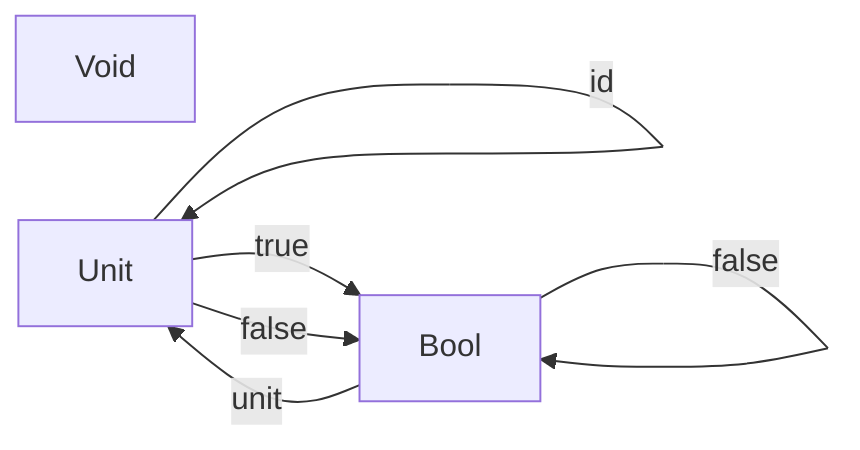

# Chapter 2 Types and Functions

<!-- toc -->

## 2.1 Who Needs Types

```admonish quote
Do we want to make monkeys happy, or do we want to produce correct programs?
```

## 2.2 Types Are About Composability

## 2.3 What Are Types?

```admonish quote
The simplest intuition for types is that they are **set** of values.
```

Here, sets can be finite or infinite.

Ideally we can consider types to be sets and functions to be mathematical functions between sets. But we will encounter the halting problem since there are functions that never terminate. That is why we introduce \\(\bot\\), which means a non-terminating computation. So a function with the following signature:

```rust
fn f(x: bool) -> bool {}
```

may return `true`, `false`, or \\(\bot\\).

For example, the following program:

```rust
{{#rustdoc_include code/ch02/non_terminating.rs}}
```

compiles but never terminate.

Such functions are called **partial functions**, as opposed to **total functions**, which return valid results for every possible argument.

## 2.4 Why Do We Need a Mathematical Model?

```admonish quote
The problem is that it's very hard to prove things about programs using operational semantics.
```

An alternative is *denotational semantics*, which is based on math.

Difficulty: computational effects (e.g., I/O)

Solution: mapping to monads (by Eugenio Moggi)

```admonish quote
One of the important advantages of having a mathematical model for programming is that it’s possible to perform formal proofs of correctness of software.
```

## 2.5 Pure and Dirty Functions

```admonish note title="What is a pure function?"
A **pure function** is a function which is guaranteed to produce the same output every time it's called with the same input, and has no side effects.
```

## 2.6 Examples of Types

Empty set: Haskell `Void` (not C++ `void`, which is actually `unit`).

Singleton set: C++ `void`, Haskell/Rust `()`.

A function without explicit arguments does not mean it takes nothing. This is best shown in Haskell:

```haskell
f44 :: () -> Integer 
f44 () = 44
```

The function `f44` above obviously takes `()`, which is the only element in the singleton unit set.

```admonish quote
Functions that can be implemented with the same formula for any type are called parametrically polymorphic.
```

```rust
fn unit<T>(x: T) {}
```

Two-element set: C++/Rust `bool`, Haskell `Bool`. Functions to these two-element sets are called *predicates*.

## 2.7 Challenges

### Challenge 2.1 Higher-order `memoize`

```rust
{{#rustdoc_include code/ch02/memoize.rs}}
```

### Challenge 2.2 Memoize RNG

This cannot be reached.

### Challenge 2.3 Memoize RNG with seed

```rust
{{#rustdoc_include code/ch02/memoize_rng.rs}}
```

### Challenge 2.4 Which is pure

The factorial function is pure. Other functions have side effects (input, output, global state).

### Challenge 2.5 Bool to Bool

```rust
fn id(x: bool) -> bool {
    x
}

fn not(x: bool) -> bool {
    !x
}

fn always_true(x: bool) -> bool {
    true
}

fn always_false(x: bool) -> bool {
    false
}
```

### Challenge 2.6 Draw category


