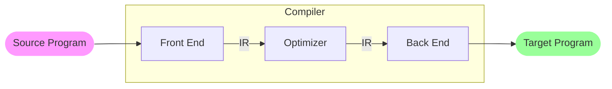
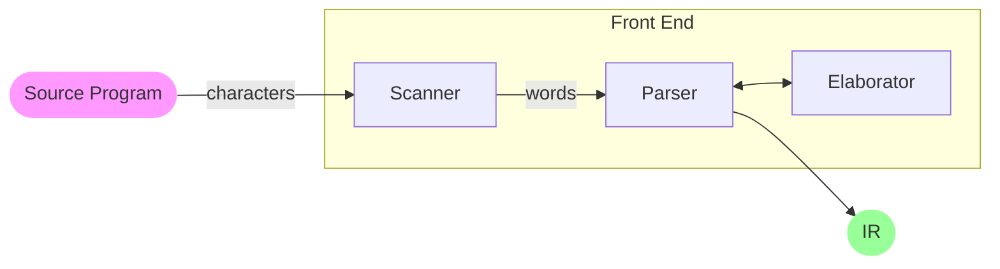

# Chapter 1 Overview of Compilation

<!-- toc -->

## 1.1 Introduction

```admonish note title="What is a compiler?"
A compiler is a computer program that translates other computer programs. It contains the front end, an optional optimizer, and the back end. Connecting the front end and the back end is an intermediate representation (IR).
```

```admonish note title="What is a source-to-source translator?"
A source-to-source translator targets other programming languages rather than the instruction set of a computer.
```

```admonish note title="What is ahead-of-time (AOT)?"
AOT is the traditional approach where translation occurs in a separate step from execution.
```

```admonish note title="What is just-in-time (JIT)?"
JIT is a more recent approach where translation occurs at run-time. In other word, the translation is delayed or lazy.
```

```admonish note title="What is a virtual machine (VM)?"
A VM is a simulator for the instruction set architecture (ISA) of an idealized processor.
```

Sometimes, practical things are much more complex. For example, JAVA programs are compiled into JAVA bytecode by an AOT compiler, then interpreted by a JAVA Virtual Machine (JVM) which usually has a JIT integrated.

## 1.2 Compiler Structure



## 1.3 Overview of Translation

### 1.3.1 The Front End

The front end contains a scanner, a parser, and an elaborator.

- The scanner converts the stream of **characters** from the input code into a stream of **words**.
- The parser fits the words from the scanner to a rule-based model of the input languages's syntax, called a **grammar**. During the incremental parsing process, the parser may call on the elaborator to perform additional computation.



To check the syntax of the input program, the parser must compare the program's structure against the grammar that defines the language.

If the parser finds a derivation (using defined grammar rules), it is proved that the input program is syntactically correct.

### 1.3.2 The Optimizer

Most optimizations consist of an analysis and a transformation.

- The analysis determines whether the compiler can safely and profitably apply the transformation.
  - Data-flow analysis
  - Dependence analysis

- The transformation rewrites the code into a more efficient form.

### 1.3.3 The Back End

The back end solves at least three major problems.

- Instruction selection — Converting the IR into operations in the target processor’s ISA.
- Instruction scheduling — Selecting an execution order for the operations.
- Register allocation — Deciding which values should reside in registers at each point in the code.

## 1.4 Engineering

```admonish quote
Compiler construction is an exercise in engineering — design and implementations under constraints.
```

## 1.5 Summary and Perspective

## Exercises

### Ex 1.1

Qualities I consider most important in a compiler

- As a user — correctness, safety, runtime speed & resource consumption, user-friendliness, compilation speed & resource consumption
- As a writer — correctness, safety, runtime speed & resource consumption, maintainability, compilation speed & resource consumption

### Ex 1.2

I think it should be seen as interpretation instead of compilation, since the displayed graphics is a result, instead of a program.

### Ex 1.3

1. The delay should be unsensible.
2. Resources are limited in the embedded environment.
3. Speed is not so important, while simplicity and clearness weigh more.
4. Parallel.
5. Compatibility.
