```mermaid
flowchart LR
    S((s_0))
    M((s_1))
    T(((s_2)))
    S-->|"{"|M
    M-->|"∑-}"|M
    M-->|"}"|T
```

# Chapter 2 Scanners

<!-- toc -->

## 2.1 Introduction

Scanner construction has a strong foundation in formal language theory. The compiler writer specifies the lexical structure of the input language using a set of regular expressions.

**Keywords**, or **reserved words**, are words that match the rule for an identifier but have special meanings.

## 2.2 Recognizing Words

### 2.2.1 A Formalism for Recognizers

Formally, transition diagrams can be viewed as **finite automata**.

A finite automaton is a 5-tuple: \\((S,\Sigma,\delta,s_0,S_A)\\):

- \\(S\\) is the finite set of states, including the error state \\(s_e\\).

- \\(\Sigma\\) is the finite alphabet.
- \\(\delta(s,c)\\) is the transition function.
- \\(s_0\\) is the start state.
- \\(S_A\\) is the set of accepting states.

### 2.2.2 Recognizing More Complex Words

### Questions

#### Question 1 Identifier FA

#### Question 2 PASCAL comment FA

### 2.3 Regular Expressions
