# Chapter 2 Scanners

<!-- toc -->

## 2.1 Introduction

Scanner construction has a strong foundation in formal language theory. The compiler writer specifies the lexical structure of the input language using a set of regular expressions.

**Keywords**, or **reserved words**, are words that match the rule for an identifier but have special meanings.

## 2.2 Recognizing Words

### 2.2.1 A Formalism for Recognizers

Formally, transition diagrams can be viewed as **finite automata**.

A finite automaton is a 5-tuple: \\((S,\Sigma,\delta,s_0,S_A)\\):

- \\(S\\) is the finite set of states, including the error state \\(s_e\\).


- \\(\Sigma\\) is the finite alphabet.
- \\(\delta(s,c)\\) is the transition function.
- \\(s_0\\) is the start state.
- \\(S_A\\) is the set of accepting states.

### 2.2.2 Recognizing More Complex Words

### Question 2.2.1 Identifier FA


### Question 2.2.2 PASCAL comment FA

```mermaid
flowchart LR
    S((s_0))
    M((s_1))
    T(((s_2)))
    S-->|"{"|M
    M-->|"∑-}"|M
    M-->|"}"|T
```



## 2.3 Regular Expressions

The set of words accepted by a finite automaton \\(F\\) forms a language \\(L(F)\\). Any language described by an RE is considered a **regular language**.

### 2.3.1 Formalizing the Notation

Three basic operations:

- Alternation: commutative.
- Concatenation
- Closure: A Kleene closure (*) denotes zero or more repetitions of the preceding expression. Closures with an upper bound for repetitions are called finite closures.

Precedence: Parentheses > Closure > Concatenation > Alternation

### 2.3.2 Examples of Regular Expressions

```admonish quote
The cost of operating an FA is proportional to the length of the input, not to the complexity of the RE or the number of states in the FA.
```

### 2.3.3 Closure Properties of REs

- REs are closed under concatenation, union, and closure.

## 2.4 From Regular Expression to Scanner

### 2.4.1 Nondeterministic Finite Automata

In Nondeterministic Finite Automata (NFA), transition functions can be multivalued and can include \\(\epsilon\\)-transitions.

There are two distinct models for NFAs, which are different in the behavior when the NFA must make a nondeterministic choice:

- Follow the transition that leads to an accepting state.
- Clone itself to pursue each possible transition.

```admonish quote
- Any DFA is a special case of an NFA.
- Any NFA can be simulated by a DFA.
```

### 2.4.2 RE to NFA: Thompson's Construction

Thompson's construction uses a simple, template-driven process to build up an NFA from smaller NFAs.

### 2.4.3 NFA to DFA: The Subset Construction

The subset construction is actually a Breadth-First Search (BFS).

#### Fixed-Point Computations

The validity of the subsect construction algorithm is based on the fact that set union is both commutative and associative.

### 2.4.4 DFA to Minimal DFA
