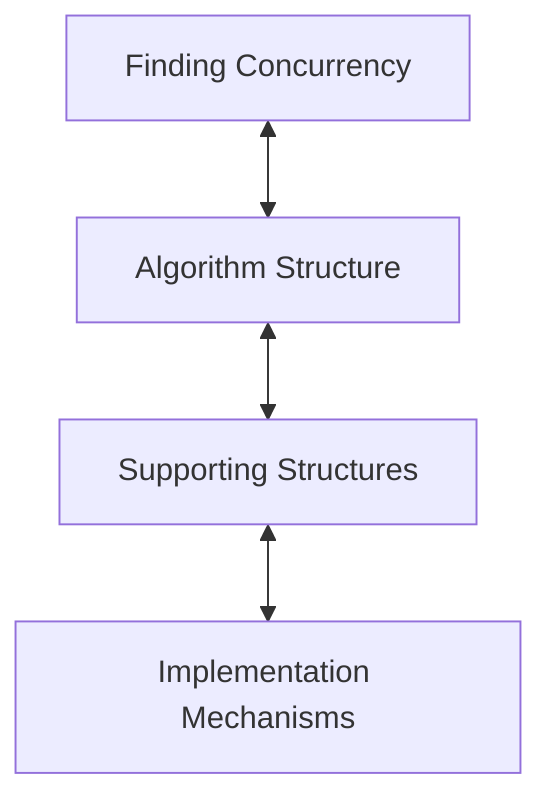

# A Pattern Language for Parallel Programming

<!-- toc -->

## 1.1 Introduction

## 1.2 Parallel Programming

```admonish quote
The key to parallel computing is exploitable concurrency.

Even when a parallel program is "correct", it may fail to deliver the anticipated performance  improvement from exploiting concurrency. Care must be taken to ensure that the overhead incurred by  managing the concurrency does not overwhelm the program runtime
```

## 1.3 Design Patterns and Pattern Languages

## 1.4 A Pattern Language for Parallel Programming


