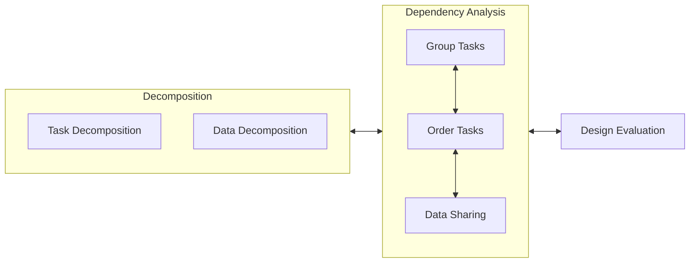

# The Finding Concurrency Design Space

<!-- toc -->

## 3.1 About the Design Space

```admonish quote
Parallel programs attempt to solve bigger problems in less time by simultaneously solving different parts of the problem on different processing elements. This can only work, however, if the problem contains exploitable concurrency, that is, multiple activities or tasks that can execute at the same time.
```

### 3.1.1 Overview



### 3.1.2 Using the Decomposition Patterns

### 3.1.3 Background for Examples

#### Medical Imaging

PET (Positron Emission Tomography)

- TD: Associating each trajectory with a task
- DD: Partition the body into sections

#### Linear Algebra

#### Molecular Dynamics

Pick a distance beyond which the force contribution is so small that it can be ignored.

## 3.2 The Task Decomposition Pattern

How can a problem be decomposed into tasks that can execute concurrently?

- A good understanding of the problem being solved.
  - Which are the computationally intensive parts of the problem?
  - What are the key data structures?
  - How does the data unfold?
- Define the tasks that make up the problem.
  - How do they imply the data decomposition?

Design principles:

- Flexibility
- Efficiency
- Simplicity

Solution: first identify as many tasks as possible and merge them later on.
  
Where are the tasks?

- Functional decomposition: a task for each function call.
- Loop splitting: map each iteration onto a task.
- Decompose a large data structure into individual chunks.

The next step will be data decomposition.

```admonish quote
Many problems can be decomposed primarily in terms of data or primarily in terms of tasks. If a task-­based decomposition avoids the need to break up and distribute complex data structures, it will be a much simpler program to write and debug. On the other hand, if memory and/or network bandwidth is a limiting factor, a decomposition that focuses on the data might be more effective.
```

A detailed example (Figure 3.3) is given for molecular dynamics.

## 3.3 The Data Decomposition Pattern

How can a problem's data be decomposed into units that can be operated on relatively independently?

A data-based decomposition is good if:

- The most computationally intensive part is organized around the manipulation of a large data structure.
- Similar operations are being applied to independent parts of the data structure.

For shared-memory environments, the data decomposition is often implied by the task decomposition. But for distributed-memory environments, the data decomposition must be done by hand.

Look at the central data structures, instead of the tasks.

- There might be some symmetry in the data structure which can be exploited.
- In the distributed-memory case, some data can be replicated on each node to save communication.

## 3.4 The Group Tasks Pattern

## 3.5 The Order Tasks Pattern

## 3.6 The Data Sharing Pattern

## 3.7 The Design Evaluation Pattern

## 3.8 Summary
